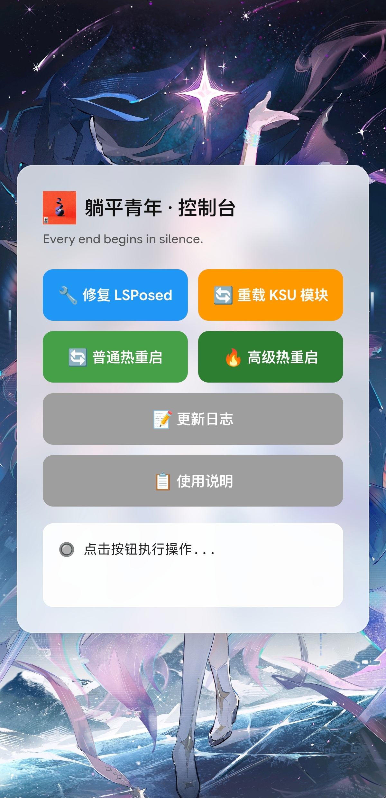

**English** | [简体中文](README_CN.md) 

# Lowlife

A KernelSU module designed for temporary root environment.

---

## Screenshots

---

---

## Module Purpose

This module only provides basic environment hiding capabilities for regular detection scenarios.

⚠️ If you encounter detections that this module cannot bypass, you need to combine it with other solutions.

### `Repair LSPosed`
Refresh KSU state + choose hot reboot type

### `Reload KSU Modules`
Reload all module lifecycle scripts, no reboot

### `Hot Reboot`
- **Normal Hot Reboot**: No environment hiding after reboot
- **Advanced Hot Reboot**: Automatically apply environment hiding after reboot

---

## Notes

- It is recommended to execute "Reload KSU Modules" first, then "Repair LSPosed".
- To enable environment hiding, use "Advanced Hot Reboot".
- Hiding effectiveness depends on current system state; if it fails, try re-executing.
- In temporary root environments, a cold reboot will cause root loss.

---

## Download

Visit the [Releases](https://github.com/ENDDREAM-ZM/Lowlife/releases) page to download the latest version.

- [Lowlife-v1.0](https://github.com/ENDDREAM-ZM/Lowlife/releases/download/v1.0/Lowlife-v1.0.zip)
- [Lowlife-v2.0](https://github.com/ENDDREAM-ZM/Lowlife/releases/download/v2.0/Lowlife-v2.0.zip)

---

## Test Environment

- **Device**: Xiaomi 15 (dada)
- **System**: OS3.0.7.0.WOCCNXM
- **KernelSU**: v3.3.0 (32601-2)

---

## Author

ENDDREAM

---

## Disclaimer

- This module is developed by DeepSeek.
- All operations are performed in memory only
- No physical partitions are modified, and no dangerous operations are involved.
